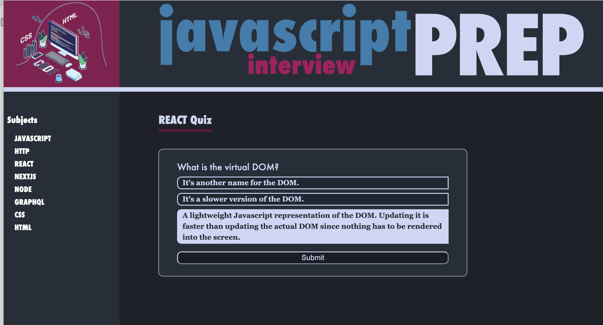

## Javascript Interview Prep

## Description
The Javascript intervie prep app is your go to place when searching fo jobs as a full stack developer. Here you will find quizzes to test your knowledge and practice, some common algorithms examples and code snippets which are frequently asked in interviews.

The application is written with Next,js as a static web app, fetching data from json files and deployed on Vercel.

Is is still work in progress in terms of functionality and content and
Current version can be access through this [url](https://quiz-nextjs-xi.vercel.app)

## Table of Contents
* [Usage](#Usage)
* [License](#License)
* [Questions](#Questions)

## Usage
This app doesn't require any additional accounts in order to function properly.  

## License
This project is covered under the ISC license.

## Questions
GitHub: [github.com/hcs847](http://github.com/hcs847)  

